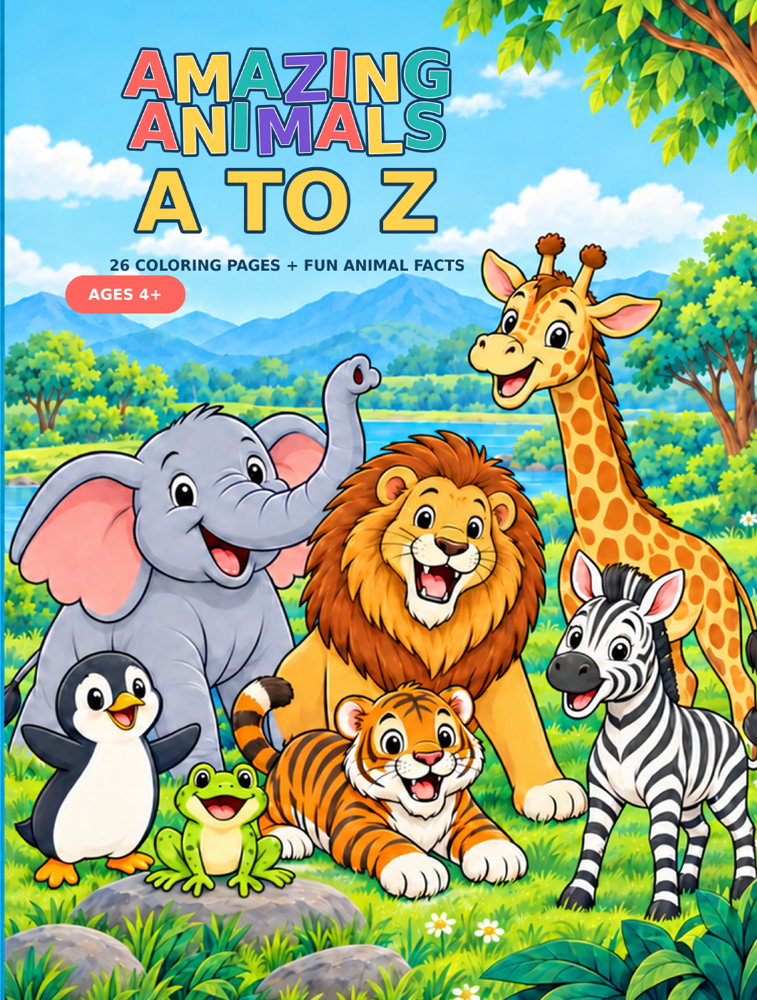

# Amazing Animals A to Z

**A coloring and learning book for ages 4+ by Brandon Hui.**

Meet 26 animals, one for every letter of the alphabet, through coloring pages and simple animal facts. Designed for children ages 4 and up, with parents, caregivers, and educators supporting the fun.

**[Buy on Amazon](https://www.amazon.com/dp/B0HL1LVPPR)** · **[Preview A–E](Amazing-Animals-A-to-Z-Sample-A-E.pdf)** · **[Download the sample PDF](https://github.com/culturelight/amazing-animals-a-z/raw/refs/heads/main/Amazing-Animals-A-to-Z-Sample-A-E.pdf)**

## Try the A–E sample

Ant, Bear, Cat, Dog, and Elephant coloring pages, plus their animal facts. You may print the sample for personal, noncommercial use at home or in a classroom.

## About the author

Brandon Hui is the author of *Amazing Animals A to Z* and an IT infrastructure leader with interests in technology, learning, and creative projects.

## Paperback

First edition, 2026. ISBN: **9798175703109**.

## Copyright and sample use

Copyright © 2026 Brandon Hui. All rights reserved.

Please share the link to this repository rather than redistributing the files. Do not resell, republish, or reuse the illustrations in other products without written permission. See [COPYRIGHT.md](COPYRIGHT.md) for details.
